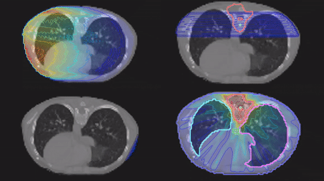
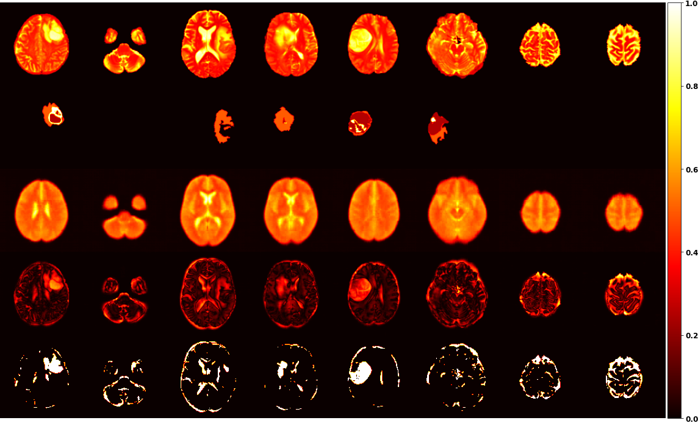
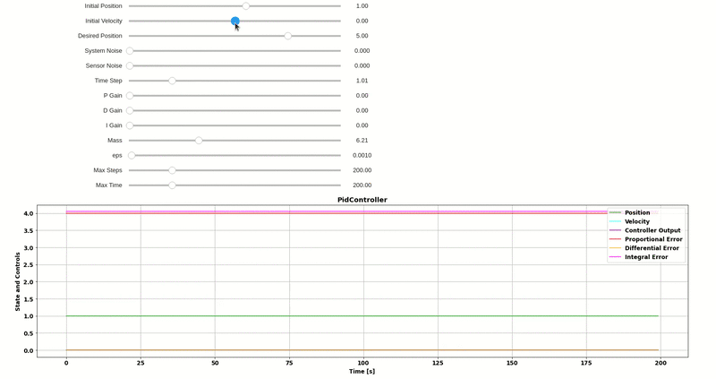
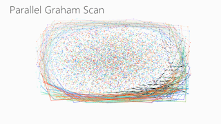
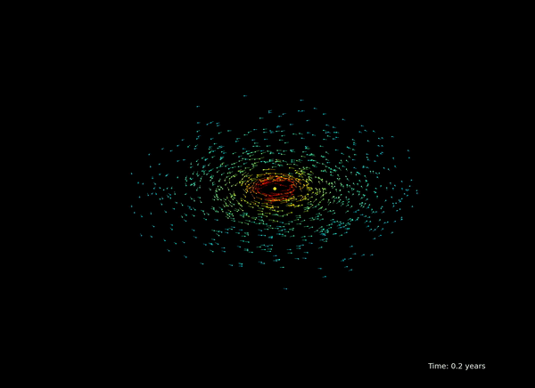
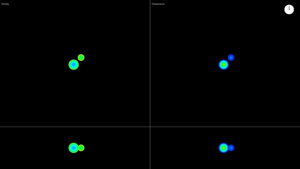

# Some of my projects

## A Nostalgic Particle Filter Tracker
Good old times.

  

## Radiological Treatment Planning System
This is an implementation of a 2D treatment planning system with all
major components such as radiological depth calculation, dose distribution
calculations and fluence map optimization using constrained Gradient Descent optimization. [Want more GIF's?](https://github.com/matthaeusheer/treatment-planner)

  

## Creating a Semantic Building Map
How would a [fire-fighting drone](https://www.mbzirc.com/challenge/2020) know how to enter a building and put
those fires down? I might be able help with that.

  

## Masters Thesis on Unsupervised Anomaly Detection
Detecting lesions in brain MRI scans using unsupervised Deep Representation Learning at the
[Computer Vision Lab at ETHZ](https://vision.ee.ethz.ch/).

  

## PID Controller
If you want to learn how it works - code it up yourself! Or check out [my attempt](https://github.com/matthaeusheer/playground/tree/main/pid_contoller) of a PID controller test suite here.

  

## Parallelizing 2D Convex Hull Finding Algorithms
Implementations and benchmarks of several convex hull computation algorithms with some neat OpenMP parallelization going on. Amongst others, Quickhull, Jarvis,
Graham, Chan and combinations thereof. Want to find out [more](https://github.com/matthaeusheer/dphpc-project)?

  

## Making Evolutionary Optimization Algorithms Go Fast
This project was all about
implementing some nice animal-inspired
optimization algorithms and getting the last bit of performance out of them.
Get your [daily dosis](https://github.com/matthaeusheer/fastcode) of C and SIMD instructions here!

  

## 3D Vision and the Hololens
Want to explore a site? Someone needs to tell you where you haven't
looked yet!

  

## Planetary Collisions and How the Solar System Formed
Those where the questions I investigated on during my Bachelors thesis at the [Institute for Computational Science at the University of Zurich](https://www.ics.uzh.ch/en/).

  

  

## SPH Simulations
Fun little project implementing [Smoothed Particle Hydrodynamics](https://en.wikipedia.org/wiki/Smoothed-particle_hydrodynamics#:~:text=Smoothed%2Dparticle%20hydrodynamics%20(SPH),1977%2C%20initially%20for%20astrophysical%20problems.)
simulations and some underlying tree datastructures.

  

## Finding People in the Wild
This drone is capable of deciding who needs help down there!

  

