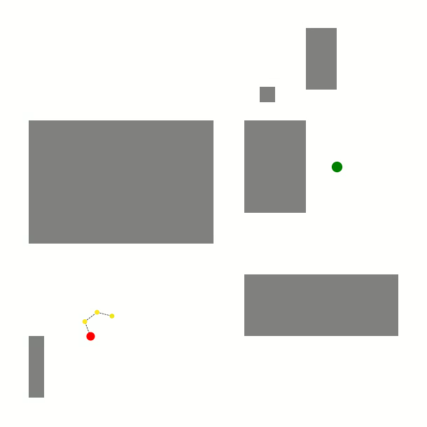

I am a Masters Student at [University of Zurich](https://www.uzh.ch/de.html) and [ETH Zurich](https://ethz.ch/de.html) in Biological and Medical Physics. I like coding, climbing and people.  

These are some of my projects.
## Radiological Treatment Planning System
My implementation of a 2D treatment planning system including all
major components such as radiological depth calculation, dose distribution
calculations and fluence map optimization using
constrained Gradient Descent optimization.
[Code and more GIF' here!](https://github.com/matthaeusheer/treatment-planner)

  

## Creating a Semantic Building Map
How would a [fire-fighting drone](https://www.mbzirc.com/challenge/2020)
know how to enter a building and put those fires down?
In my work at the [Autonomous Systems Lab](https://asl.ethz.ch/) at
ETH Zurich I attempted to provide answers.

  

## A RRT (Rapidly-Exploring Random Trees)-based Path Planner
Some Monte-Carlo sampling action to get from A to B.

  

## Masters Thesis on Unsupervised Anomaly Detection
Detecting lesions in brain MRI scans using unsupervised Deep
Representation Learning at the
[Computer Vision Lab](https://vision.ee.ethz.ch/) at ETH Zurich.

  

## PID Controller
A real classic. If you want to learn how it works - code it up yourself!
Or check out [my implementation](https://github.com/matthaeusheer/playground/tree/main/pid_contoller)
of a PID controller test suite here.

  

## A 3D OpenGL Renderer
A fast [3D renderer](https://github.com/matthaeusheer/sph-gl) to visualize SPH point cloud data from planetary collisions in pure OpenGL and C++.

  

## Parallelizing 2D Convex Hull Finding Algorithms
Implementations and benchmarks of several convex hull computation
algorithms with some neat OpenMP parallelization going on.
Algorithms include Quickhull, Jarvis,
Graham, Chan and combinations thereof.
Find out [more](https://github.com/matthaeusheer/dphpc-project) here.

  

## Making Evolutionary Optimization Algorithms Go Fast
This project about implementing various [Meta-Heuristic Optimiztaion](http://www.scholarpedia.org/article/Metaheuristic_Optimization)
algorithms and squeezing the last bit of performance out of them.
Get your [daily dosis](https://github.com/matthaeusheer/fastcode) of C and SIMD instructions here!

  

## A Nostalgic Particle Filter Object Tracker
Good old times.

  

## 3D Vision and the Hololens
Want to explore a site? Someone needs to tell you where you haven't
looked yet!

  

## Planetary Collisions and How the Solar System Formed
Questions I investigated on during my Bachelors
Thesis at the
[Institute for Computational Science at the University of Zurich](https://www.ics.uzh.ch/en/).

  

  

## SPH Simulations
Fun little project implementing [Smoothed Particle Hydrodynamics](https://en.wikipedia.org/wiki/Smoothed-particle_hydrodynamics#:~:text=Smoothed%2Dparticle%20hydrodynamics%20(SPH),1977%2C%20initially%20for%20astrophysical%20problems.)
simulations and some underlying tree datastructures.

  

## Finding People in the Wild
This drone is capable of deciding who needs help down there!
Project for the Swiss Air Rescue Service for autonomous Search&Rescue
missions.

  

